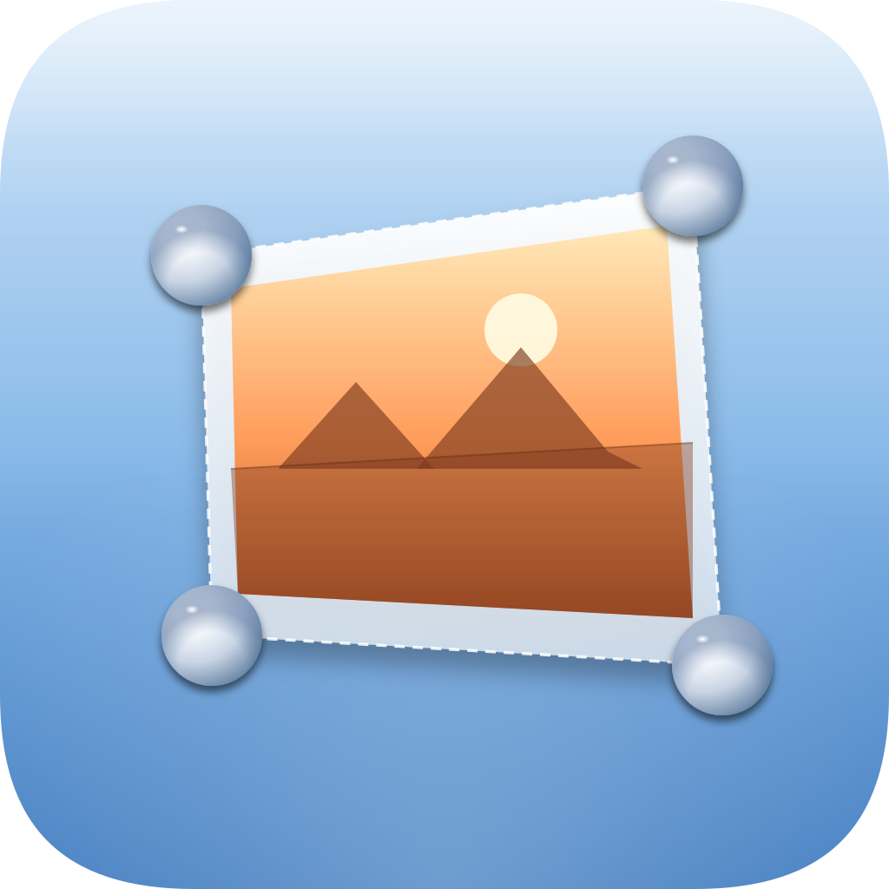

<div align="center">
  

  # Quadra

  **Square it up.**

  A simple desktop app for macOS to fix perspective, straighten and crop your photos.
</div>

---

## Download

👉 **[Download the latest release](../../releases/latest)** for macOS (Apple Silicon and Intel).

After downloading:
1. Unzip the file
2. Drag `Quadra.app` into your `/Applications` folder
3. **First launch**: right-click on `Quadra.app` → *Open* → *Open* (the app is unsigned, so macOS will ask for confirmation only the first time)

## What it does

Quadra helps you fix images that need geometric correction:

- 🖼️ **Perspective correction** — drag 4 corner handles around any tilted rectangle (a book page, a sign, a wall) and Quadra straightens it for you
- 📏 **Straighten by reference line** — draw a line on a horizontal or vertical reference (like the horizon) and Quadra rotates the image to make it level
- 🔄 **Granular rotation** — slider and numeric input with decimal precision (-180° to +180°)
- ⤧ **Horizontal & vertical skew** — fine-tune perpendicularity
- ✂️ **Manual crop** — rectangular crop with 8 handles + draggable interior
- 📐 **Resize** — width/height in pixels or scale percentage, with optional aspect ratio lock
- 💾 **Save** in PNG, JPG, or WebP format with adjustable quality
- 🖱️ **Open with Quadra** — right-click an image in Finder and pick Quadra from the "Open With" menu

Everything happens locally on your machine. No uploads, no servers.

## How to use

1. **Open an image** — drag & drop, click "Open…" (or press ⌘O), or paste from clipboard (⌘V)
2. **Choose your tool** in the right sidebar:
   - **Perspective**: drag the 4 corner handles to mark the corners of what should be straightened. The preview on the right shows the result live.
   - **Straighten**: draw a line on a reference (horizon, vertical edge, etc.), see the suggested rotation, click "Apply rotation".
3. **Adjust** rotation, skew, and crop as needed
4. **Resize** if you want a specific output size
5. **Save** (overwrite original) or **Save As…** (choose a new file)

### Magnifier loupe

While dragging any handle, a circular loupe appears with a 3× zoom of the area, so you can position handles with pixel-perfect precision.

### Keyboard shortcuts

| Shortcut | Action |
|----------|--------|
| ⌘O | Open image |
| ⌘S | Save |
| ⇧⌘S | Save As… |
| ⇧⌘R | Reset all transformations |
| ⌘V | Paste image from clipboard |

## For developers

### Build from source

You'll need [Node.js](https://nodejs.org/) (v18+).

```bash
git clone https://github.com/spleenteo/quadra.git
cd quadra
npm install
npm run dev          # run the app in development mode
npm run dist         # build a distributable .app for macOS
```

The built app will be in `dist/mac-arm64/` (Apple Silicon) and `dist/mac/` (Intel).

### Tech stack

- [Electron](https://www.electronjs.org/) for the desktop wrapper
- Vanilla JavaScript (no framework)
- WebGL for perspective unwarp (custom homography shader)
- Canvas 2D for rotation, skew, crop, resize
- No build step for the renderer (ES modules loaded natively)

### Project structure

```
quadra/
├── main.js              # Electron main process (window, menu, IPC)
├── preload.js           # safe IPC bridge
├── renderer/
│   ├── index.html       # UI
│   ├── styles.css       # dark theme
│   ├── app.js           # all renderer logic
│   └── transform.js     # WebGL perspective pipeline
├── assets/
│   ├── icon.svg         # icon source
│   ├── icon.png         # 1024x1024 export
│   └── icon.icns        # macOS bundle icon
└── scripts/
    └── build-icon.js    # regenerates icon.png from icon.svg
```

## License

MIT
