# Perspective Desktop App — Breadboard (Detail A: Electron)

## Places

| # | Place | Description |
|---|-------|-------------|
| P1 | App Window (Renderer) | La finestra principale dell'app. Stato condizionale: vuota se nessuna immagine caricata, editor completo se sì |
| P2 | Open File Dialog | Dialog nativo macOS "Apri" — blocca la finestra |
| P3 | Save As Dialog | Dialog nativo macOS "Salva come" — blocca la finestra |
| P4 | Main Process | Processo Node.js di Electron. Ospita menu, IPC handler, accesso filesystem |
| P5 | Filesystem | File immagine sul disco dell'utente |

P2 e P3 sono dialog nativi del sistema operativo — non li disegniamo internamente, sono triggerati da Main e tornano risultato.

---

## UI Affordances

| # | Place | Componente | Affordance | Control | Wires Out | Returns To |
|---|-------|------------|------------|---------|-----------|------------|
| U1 | P1 | empty-state | Drop zone | drop | → N2 | — |
| U2 | P1 | empty-state | "Apri immagine" button | click | → N20 (via IPC) | — |
| U3 | P1 | empty-state | Hint "trascina o incolla" | render | — | — |
| U4 | P1 | editor-canvas | Original canvas (immagine sorgente) | render | — | ← S1 |
| U5 | P1 | editor-canvas | 4 maniglie angolari (perspective) | drag | → N7 | ← S2 |
| U6 | P1 | editor-canvas | Preview canvas (risultato) | render | — | ← N4 |
| U7 | P1 | toolbar | "Reset prospettiva" | click | → N12 | — |
| U8 | P1 | crop-tool | Toggle crop mode | click | → N13 | — |
| U9 | P1 | crop-tool | Maniglie rettangolo crop | drag | → N14 | ← S3 |
| U10 | P1 | crop-tool | Conferma crop | click | → N15 | — |
| U11 | P1 | crop-tool | Annulla crop | click | → N16 | — |
| U12 | P1 | rotation-panel | Slider rotazione | drag | → N8 | ← S4 |
| U13 | P1 | rotation-panel | Input numero rotazione (gradi decimali) | type | → N8 | ← S4 |
| U14 | P1 | skew-panel | Slider skew H | drag | → N8 | ← S5 |
| U15 | P1 | skew-panel | Input numero skew H | type | → N8 | ← S5 |
| U16 | P1 | skew-panel | Slider skew V | drag | → N8 | ← S5 |
| U17 | P1 | skew-panel | Input numero skew V | type | → N8 | ← S5 |
| U18 | P1 | resize-panel | Input larghezza (px) | type | → N9 | ← S6 |
| U19 | P1 | resize-panel | Input altezza (px) | type | → N9 | ← S6 |
| U20 | P1 | resize-panel | Input percentuale | type | → N9 | ← S6 |
| U21 | P1 | resize-panel | Toggle lock aspect ratio | click | → N9 | ← S6 |
| U22 | P1 | toolbar | "Reset tutto" | click | → N17 | — |
| U23 | P1 | toolbar | "Salva" (sovrascrivi) | click | → N5 | — |
| U24 | P1 | toolbar | "Salva come…" | click | → N6 | — |
| U25 | P1 | format-panel | Selettore formato PNG/JPG | click | → N18 | ← S8 |
| U26 | P1 | format-panel | Slider qualità JPG (visibile se JPG) | drag | → N18 | ← S9 |
| U27 | P1 | header | Display nome file e path corrente | render | — | ← S7 |
| U28 | P1 | header | Indicatore "modifiche non salvate" | render | — | ← S10 |
| U30 | P4 → P1 | menu-app | File > Apri (Cmd+O) | click | → N20 | — |
| U31 | P4 → P1 | menu-app | File > Salva (Cmd+S) | click | → N5 (via IPC) | — |
| U32 | P4 → P1 | menu-app | File > Salva come (Cmd+Shift+S) | click | → N6 (via IPC) | — |
| U33 | P4 → P1 | menu-app | File > Reset (Cmd+R) | click | → N17 (via IPC) | — |
| U34 | P4 → P1 | menu-app | Edit > Incolla (Cmd+V) | click/keydown | → N3 | — |

Note:
- I menu (U30-U34) sono **disegnati e gestiti dal Main process** (sono la barra menu macOS dell'app), ma agiscono sul Renderer via IPC. Da utente sembrano parte di P1.
- U5 (4 maniglie) sono renderizzate sopra U4 come overlay HTML/canvas.

---

## Non-UI Affordances

| # | Place | Componente | Affordance | Control | Wires Out | Returns To |
|---|-------|------------|------------|---------|-----------|------------|
| N1 | P1 | image-loader | `openImage(blobOrBuffer, sourcePath?)` | call | → S1, → S7, → N4 | — |
| N2 | P1 | image-loader | drop handler (legge File API) | receive | → N1 | — |
| N3 | P1 | image-loader | paste handler (legge clipboard) | receive | → N1 | — |
| N4 | P1 | render-pipeline | `applyTransform()` — compone tutto | call | → N9glsl | ← N7, N8, N9, N15, N17 |
| N4b | P1 | render-pipeline | rAF debounce (richiede frame) | call | → N4 | — |
| N5 | P1 | save-controller | `saveCurrent()` — usa S7 | call | → N11, → N22 (via IPC) | — |
| N6 | P1 | save-controller | `saveAs()` | call | → N21 (via IPC), poi → N11 → N22 | — |
| N7 | P1 | perspective-tool | `handleCornerDrag(corner, x, y)` | call | → S2, → N4b | — |
| N8 | P1 | transform-controls | `setRotation/SkewH/SkewV(value)` | call | → S4/S5, → N4b | — |
| N9 | P1 | resize-controls | `setResize(w, h, %, lock)` | call | → S6, → N4b | — |
| N9glsl | P1 | render-pipeline | WebGL perspective shader (glfx-style) | call | — | → N11, → U6 |
| N10 | P1 | render-pipeline | Canvas 2D pass per crop/skew/rotate | call | — | → N9glsl |
| N11 | P1 | export | `encodeOutput(format, quality)` → Blob/Buffer | call | — | → N5, → N6 |
| N12 | P1 | perspective-tool | `resetPerspective()` — riporta handles agli angoli | call | → S2, → N4b | — |
| N13 | P1 | crop-tool | `enterCropMode()` | call | → S3 (init rect) | — |
| N14 | P1 | crop-tool | `updateCropRect()` | call | → S3, → N4b | — |
| N15 | P1 | crop-tool | `applyCrop()` | call | → S1 (sostituisce con crop), → S3 (clear) | — |
| N16 | P1 | crop-tool | `cancelCrop()` | call | → S3 (clear) | — |
| N17 | P1 | reset-controller | `resetAll()` — azzera S2..S6 | call | → S2, S3, S4, S5, S6, → N4b | — |
| N18 | P1 | format-panel | `setFormat(fmt)` / `setQuality(q)` | call | → S8, → S9 | — |
| N20 | P4 | ipc-handler | `'open-dialog'` → mostra Open Dialog | call | → P2 | → N1 (con buffer letto da N22b) |
| N21 | P4 | ipc-handler | `'save-as-dialog'` → mostra Save As Dialog | call | → P3 | → N6 (path scelto) |
| N22 | P4 | fs-handler | `'write-file'` → `fs.writeFile(path, buffer)` | call | → S20 | → N5/N6 (ack) |
| N22b | P4 | fs-handler | `'read-file'` → `fs.readFile(path)` | call | ← S20 | → N20 (buffer) |
| N23 | P4 | menu-builder | Definisce App Menu (File, Edit) | startup | → U30..U34 | — |
| N24 | P4 | menu-router | Click su menu item → `webContents.send('menu:event')` | call | → N1/N5/N6/N17 (renderer) | — |
| N25 | P4 | window-builder | Crea BrowserWindow con preload | startup | → P1 | — |
| N26 | P4 | unsaved-guard | Intercetta `close` se S10=true → conferma | call | → P3 (opzionale) | — |

---

## Stores

| # | Place | Store | Descrizione |
|---|-------|-------|-------------|
| S1 | P1 | `imageData` | ImageBitmap dell'immagine sorgente caricata |
| S2 | P1 | `cornerPoints` | Array di 4 `{x, y}` per la prospettiva |
| S3 | P1 | `cropRect` | `{x, y, w, h}` o `null` |
| S4 | P1 | `rotationAngle` | Numero (gradi decimali, es. 12.34) |
| S5 | P1 | `skew` | `{h: number, v: number}` |
| S6 | P1 | `resize` | `{width, height, percent, lockAspect}` |
| S7 | P1 | `currentFilePath` | Path assoluto del file aperto, o `null` (es. da clipboard) |
| S8 | P1 | `outputFormat` | `'png' \| 'jpg'` |
| S9 | P1 | `jpgQuality` | `0..1` |
| S10 | P1 | `isDirty` | `true` se ci sono modifiche non salvate |
| S20 | P5 | File immagine su disco | Esterno (filesystem utente) |

---

## Wiring (Mermaid)

```mermaid
flowchart TB
    subgraph P5["P5: Filesystem"]
        S20["S20: file immagine"]
    end

    subgraph P4["P4: Main Process"]
        N20["N20: open-dialog handler"]
        N21["N21: save-as-dialog handler"]
        N22["N22: write-file (fs.writeFile)"]
        N22b["N22b: read-file (fs.readFile)"]
        N23["N23: App Menu builder"]
        N24["N24: menu router (IPC send)"]
        N25["N25: window builder"]
        N26["N26: close guard"]
    end

    subgraph P2["P2: Open Dialog (nativo)"]
        OD["showOpenDialog"]
    end

    subgraph P3["P3: Save As Dialog (nativo)"]
        SD["showSaveDialog"]
    end

    subgraph P1["P1: App Window (Renderer)"]
        subgraph empty["empty-state (se !S1)"]
            U1["U1: Drop zone"]
            U2["U2: Apri immagine"]
            U3["U3: Hint"]
        end

        subgraph editor["editor-canvas (se S1)"]
            U4["U4: Original canvas"]
            U5["U5: 4 maniglie perspective"]
            U6["U6: Preview canvas"]
        end

        subgraph cropTool["crop-tool"]
            U8["U8: Toggle crop"]
            U9["U9: Maniglie rect"]
            U10["U10: Conferma"]
            U11["U11: Annulla"]
        end

        subgraph transformPanel["transform panels"]
            U12["U12: Slider rotaz"]
            U13["U13: Input rotaz"]
            U14["U14: Slider skew H"]
            U16["U16: Slider skew V"]
            U18["U18: Resize W"]
            U19["U19: Resize H"]
            U20["U20: Resize %"]
            U21["U21: Lock aspect"]
        end

        subgraph toolbar["toolbar"]
            U7["U7: Reset prospettiva"]
            U22["U22: Reset tutto"]
            U23["U23: Salva"]
            U24["U24: Salva come"]
            U25["U25: Formato PNG/JPG"]
            U26["U26: Qualità JPG"]
        end

        subgraph header["header"]
            U27["U27: Path file"]
            U28["U28: Dirty indicator"]
        end

        N1["N1: openImage"]
        N2["N2: drop handler"]
        N3["N3: paste handler"]
        N4["N4: applyTransform"]
        N4b["N4b: rAF debounce"]
        N5["N5: saveCurrent"]
        N6["N6: saveAs"]
        N7["N7: handleCornerDrag"]
        N8["N8: setRotation/Skew"]
        N9["N9: setResize"]
        N9glsl["N9glsl: WebGL shader"]
        N10["N10: Canvas 2D pass"]
        N11["N11: encodeOutput"]
        N12["N12: resetPerspective"]
        N13["N13: enterCropMode"]
        N14["N14: updateCropRect"]
        N15["N15: applyCrop"]
        N16["N16: cancelCrop"]
        N17["N17: resetAll"]
        N18["N18: setFormat/Quality"]

        S1[("S1: imageData")]
        S2[("S2: cornerPoints")]
        S3[("S3: cropRect")]
        S4[("S4: rotation")]
        S5[("S5: skew")]
        S6[("S6: resize")]
        S7[("S7: currentFilePath")]
        S8[("S8: outputFormat")]
        S9[("S9: jpgQuality")]
        S10[("S10: isDirty")]
    end

    subgraph menuPlace["menu-app (drawn by P4, acts on P1)"]
        U30["U30: File > Apri"]
        U31["U31: File > Salva"]
        U32["U32: File > Salva come"]
        U33["U33: File > Reset"]
        U34["U34: Edit > Incolla"]
    end

    %% Open flows
    U1 --> N2
    U2 --> N20
    U30 --> N20
    N20 --> P2
    P2 -.->|path| N22b
    N22b -.->|buffer| N1
    N2 --> N1
    U34 --> N3
    N3 --> N1
    N1 --> S1
    N1 --> S7
    N1 --> N4

    %% Transform flows
    U5 --> N7
    N7 --> S2
    N7 --> N4b
    U12 --> N8
    U13 --> N8
    U14 --> N8
    U16 --> N8
    N8 --> S4
    N8 --> S5
    N8 --> N4b
    U18 --> N9
    U19 --> N9
    U20 --> N9
    U21 --> N9
    N9 --> S6
    N9 --> N4b
    U7 --> N12
    N12 --> S2
    N12 --> N4b

    %% Crop flow
    U8 --> N13
    N13 --> S3
    U9 --> N14
    N14 --> S3
    N14 --> N4b
    U10 --> N15
    N15 --> S1
    N15 --> S3
    U11 --> N16
    N16 --> S3

    %% Reset all
    U22 --> N17
    U33 --> N17
    N17 --> S2
    N17 --> S3
    N17 --> S4
    N17 --> S5
    N17 --> S6
    N17 --> N4b

    %% Render pipeline
    N4b --> N4
    S1 -.-> N4
    S2 -.-> N4
    S3 -.-> N4
    S4 -.-> N4
    S5 -.-> N4
    S6 -.-> N4
    N4 --> N10
    N10 --> N9glsl
    N9glsl -.-> U6

    %% Display sources
    S1 -.-> U4
    S2 -.-> U5
    S3 -.-> U9
    S7 -.-> U27
    S10 -.-> U28

    %% Save flows
    U23 --> N5
    U31 --> N5
    U24 --> N6
    U32 --> N6
    N5 --> N11
    N6 --> N21
    N21 --> P3
    P3 -.->|path| N6
    N6 --> N11
    N11 --> N22
    N22 --> S20
    N22 -.->|ack| S10

    %% Format
    U25 --> N18
    U26 --> N18
    N18 --> S8
    N18 --> S9
    S8 -.-> N11
    S9 -.-> N11

    %% Menu / window setup
    N25 --> P1
    N23 --> U30
    N23 --> U31
    N23 --> U32
    N23 --> U33
    N23 --> U34
    N24 -.-> N1
    N24 -.-> N5
    N24 -.-> N6
    N24 -.-> N17

    %% Close guard
    S10 -.-> N26

    classDef ui fill:#ffb6c1,stroke:#d87093,color:#000
    classDef nonui fill:#d3d3d3,stroke:#808080,color:#000
    classDef store fill:#e6e6fa,stroke:#9370db,color:#000
    classDef external fill:#fff8e1,stroke:#daa520,color:#000

    class U1,U2,U3,U4,U5,U6,U7,U8,U9,U10,U11,U12,U13,U14,U16,U18,U19,U20,U21,U22,U23,U24,U25,U26,U27,U28,U30,U31,U32,U33,U34 ui
    class N1,N2,N3,N4,N4b,N5,N6,N7,N8,N9,N9glsl,N10,N11,N12,N13,N14,N15,N16,N17,N18,N20,N21,N22,N22b,N23,N24,N25,N26 nonui
    class S1,S2,S3,S4,S5,S6,S7,S8,S9,S10 store
    class S20,OD,SD external
```

---

## Slicing (V1 → V8)

| # | Slice | Mecccanismo | Affordances | Demo |
|---|-------|-------------|-------------|------|
| **V1** | Apri & mostra immagine | Pipeline I/O completa, render pipeline minima | U1, U2, U3, U4, U27, N1, N2, N20, N22b, N23, N24, N25, S1, S7 | "Doppio click sull'icona, apro un .jpg, lo vedo nella finestra" |
| **V2** | Salva & Salva Come | IPC write, dialog nativo | U23, U24, U28, U31, U32, N5, N6, N11, N21, N22, N26, S8, S10, S20 | "Apro, salvo (sovrascrivo) e salvo come... in una nuova posizione" |
| **V3** | Correzione prospettiva 4 punti | Maniglie + WebGL shader | U5, U6, U7, N4, N4b, N7, N9glsl, N10, N12, S2 | "Trascino i 4 angoli, vedo il preview live, salvo il risultato" |
| **V4** | Rotazione granulare | Slider + input numerico | U12, U13, N8, S4 | "Sposto lo slider o digito 12.5°, l'immagine ruota live" |
| **V5** | Skew H/V | Slider + input | U14, U15, U16, U17, S5 (riusa N8) | "Skew di 5° in orizzontale, vedo il preview cambiare" |
| **V6** | Crop manuale | Tool con maniglie | U8, U9, U10, U11, N13, N14, N15, N16, S3 | "Attivo crop, disegno rettangolo, confermo" |
| **V7** | Resize px/% | Input larghezza/altezza/% + lock | U18, U19, U20, U21, N9, S6 | "Imposto 1920px di larghezza con aspect lock, salvo" |
| **V8** | Format PNG/JPG + paste + reset | Selettore formato, qualità JPG, paste, reset | U22, U25, U26, U33, U34, N3, N17, N18, S9 | "Scelgo JPG q=85, incollo da clipboard, reset all" |
| **V9** | Refactor pipeline (rotation/skew prima della perspective) | Cambia ordine: rot/skew applicate all'originale visibile, perspective+crop al preview | rework di N4, N7, S2 | "Ruoto l'immagine, vedo l'originale ruotato, piazzo i 4 angoli su ciò che vedo" |

**V9 — note**: l'attuale ordine `perspective → rotation → skew → crop → resize` fa sì che rotation/skew agiscano sul *preview* (post-raddrizzamento), non sull'originale. L'utente si aspetta invece che rotation/skew modifichino la vista su cui poi piazzare i 4 angoli. Refactor: i 4 corners restano in coord dell'immagine originale; per il display, si trasformano via rotation/skew matrix; il pipeline diventa `(rotation+skew) → perspective → crop → resize`.

### Diagramma slice (vista panoramica)

```mermaid
flowchart LR
    V1["V1: Apri & mostra"] --> V2["V2: Save / Save As"]
    V2 --> V3["V3: Perspective 4-point"]
    V3 --> V4["V4: Rotazione"]
    V4 --> V5["V5: Skew H/V"]
    V5 --> V6["V6: Crop"]
    V6 --> V7["V7: Resize"]
    V7 --> V8["V8: Format + paste + reset"]

    style V1 fill:#e8f5e9,stroke:#4caf50
    style V2 fill:#e3f2fd,stroke:#2196f3
    style V3 fill:#fff3e0,stroke:#ff9800
    style V4 fill:#f3e5f5,stroke:#9c27b0
    style V5 fill:#fff8e1,stroke:#ffc107
    style V6 fill:#fce4ec,stroke:#e91e63
    style V7 fill:#e0f7fa,stroke:#00bcd4
    style V8 fill:#f1f8e9,stroke:#8bc34a
```

**Razionale dell'ordine:**

- **V1 + V2** prima di tutto: chiudere il loop "apro → salvo" senza nessuna trasformazione prova che l'intera infrastruttura (Electron + IPC + filesystem + dialog nativi + menu) funziona. Senza questo, ogni feature successiva è inutile.
- **V3** è il *core goal* (R0). Va subito dopo, perché tutto il resto è incrementale.
- **V4 → V7** sono trasformazioni indipendenti: ognuna è auto-contenuta e si appoggia alla pipeline `applyTransform` di V3.
- **V8** raccoglie le rifiniture (formato, qualità JPG, paste, reset, scorciatoie menu).

---

## Decisioni prese (2026-05-03)

1. **Crop modale**: toggle "entra in crop mode" → conferma/annulla. Maniglie crop e perspective non si sovrappongono mai.
2. **Ordine pipeline**: `perspective → rotation → skew → crop → resize`.
3. **Layout pannelli**: verticale a destra (stile Photoshop). Canvas sinistra, controlli destra.
4. **WebGL**: `glfx.js` (~10KB, vendored). No OpenCV.
5. **Save (sovrascrivi)**: sovrascrittura diretta, niente `.bak`. Save As resta l'opzione esplicita per non perdere l'originale.

## Decisioni tecniche aggiuntive

- **Linguaggio**: JavaScript vanilla (no TypeScript, no framework UI). ES modules nel browser, niente bundler in dev.
- **Build**: `electron` + `electron-builder` come uniche dev-dep significative.
- **Dev workflow**: `npm run dev` = `electron .` (hot reload manuale via Cmd+R nella finestra). In produzione: doppio click su `.app`.
